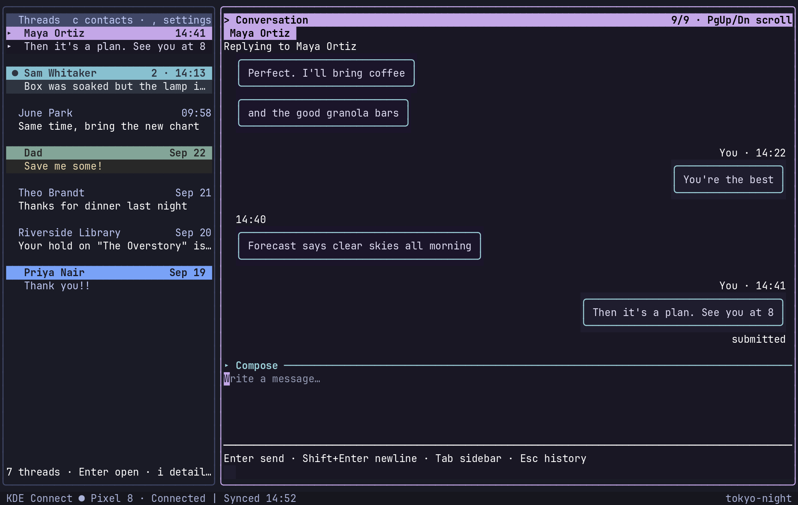

# TideSMS

Text from your terminal. TideSMS talks to your Android phone through KDE Connect, so you can read your conversations and reply without picking the phone up. It's keyboard-first, keeps everything in a local cache so it opens instantly, and works fine while the phone is away.

Built with [TideUI](https://github.com/allisonhere/tideui) and [Ripple](https://github.com/allisonhere/ripple).



<sub>Everyone in the screenshot is made up. `go run ./scripts/demo` opens the same demo, no phone required.</sub>

## What it does

- **Your real conversations**, synced from the phone and cached in SQLite. New messages arrive live.
- **Replies like a phone.** Enter sends, Shift+Enter starts a new line, and you get a few seconds to take a message back.
- **Colours per person.** Give someone a theme and their conversation, and their row in the list, wears it.
- **Pictures inline.** Photos show up right in the conversation: the real image in Kitty, Ghostty or WezTerm, and a braille sketch everywhere else.
- **Search everything** with `Ctrl+F`, including filters like `from:Sam` and `after:2026-08-01`.
- **Offline is fine.** Browse, search and write while the phone is away; queue messages to go out when it comes back, or schedule them for later.
- **An optional writing helper** that fixes spelling or rewrites a draft, with local models if you'd rather nothing leaves your machine. It never sends anything itself.

## Getting started

You'll need Go 1.26.1 or newer, KDE Connect (`kdeconnect-cli` and its daemon), and an Android phone paired with it. On the phone, enable the SMS plugin in KDE Connect and grant it permission to read and send messages.

```sh
make build
./tidesms
```

That builds `tidesms` (and the optional background sender, `tidesms-daemon`) in this directory. Nothing is installed system-wide. Run `./tidesms --help` to point it at a different config, database or log.

If exactly one connected phone has the SMS plugin, TideSMS picks it. Otherwise it asks, and you can switch any time with **Ctrl+P → Switch device**.

### Contact names

To see names instead of numbers, TideSMS can import your phone's address book. That needs **two** approvals on the phone, and the second is easy to miss:

1. Give KDE Connect the Android **Contacts** permission.
2. In the KDE Connect app, open this computer's plugin settings, **tap the Contacts row itself**, and accept the dialog that appears.

Until you do the second step, the phone quietly sends nothing back. TideSMS will tell you if that's what's happening. The import runs once automatically, and again whenever you choose **Ctrl+P → Sync phone contacts**. Set `sync_from_phone = false` if you'd rather it didn't.

## Using it

TideSMS opens on your list of conversations. **j/k** or the arrows move around; **Enter** opens a conversation with the cursor ready in the reply box. Type, press **Enter**, done.

- **n** starts a new message. It searches everyone in your address book, and typing a full number works too. If you already have a thread with that person, it opens that instead of starting a second one.
- **Esc** steps back: from the reply box to the conversation, then to the list. **Tab** jumps between the list and the reply box, and **Alt+1/2/3** go straight to the list, the conversation or the reply box.
- **c** swaps the thread list for your contacts. **Esc** swaps it back.
- **i** (or **Ctrl+L**, even while typing) opens a conversation's details: its theme and bubble colours, notifications, AI privacy, rename, and copy number.
- **Ctrl+P** opens a searchable list of every command, and **?** shows the shortcuts.

Drafts are kept per conversation, so you can wander off mid-sentence. A thread with an unfinished reply shows **Draft:** in the list.

### Sending

When you send, the message waits four seconds before it goes, and the status line counts down. Press **Esc** to take it back with your text intact, or **Enter** to send right away. Change the wait under **Settings → Undo send**, or set `undo_seconds = 0` to switch it off.

A few things worth knowing:

- **"Submitted" isn't "delivered."** KDE Connect hands the message to your phone but never reports back whether it actually went out. TideSMS says *submitted* rather than pretending otherwise. If it matters, check the phone.
- **Group chats are read-only.** You can read and search them, but KDE Connect's command line only sends to a single number, so replying to a group isn't possible.
- **Sending pictures isn't supported.** Receiving them is.
- If Ctrl+Enter or Shift+Enter don't seem to work, your terminal (or window manager) may be swallowing them. **F12** always sends, **Alt+Enter** always adds a new line, and `enter_sends = false` makes Enter a plain newline if you prefer that.

### Reading a conversation

Your messages sit on the right, theirs on the left. Messages sent close together are grouped under one header, and only your latest message shows its status.

In the conversation, **j/k** pick a message and **Enter** opens what you can do with it: copy, reply, quote, search for its text, retry a failed send, or delete the local copy. (Deleting only removes it here. The phone keeps its copy, so it can come back on the next sync.) **y** copies, **r** replies, **g/G** jump to the oldest or newest message, and **/** searches the conversation.

Pictures show inline as soon as there's something to draw. **v** opens one full-screen, downloading the full-size image first if needed, and **d** just downloads it. HEIC photos, the default camera format on a lot of phones, get converted with ImageMagick or `heif-convert` if you have either installed.

### When the phone is away

Everything you've already synced stays readable and searchable. If you send while the phone is offline, you'll be offered **Queue for later**: queued messages go out, oldest first, when it reconnects. **Ctrl+Shift+Enter** (or **Ctrl+P → Schedule message**) sends at a time of your choosing instead, and **Ctrl+P → Open outgoing queue** shows everything waiting.

If you'd like queued and scheduled messages to go out even when TideSMS isn't open, run `tidesms-daemon` (see [Background sending](#background-sending)).

## Making it yours

Press **,** (or **Ctrl+O** from anywhere) for settings. Changes preview as you make them. **Ctrl+S** saves, and **Esc** puts everything back.

**Themes.** There are about twenty built-in themes: Catppuccin, Nord, Dracula, Gruvbox, Tokyo Night, Rosé Pine and friends. On an [Omarchy](https://omarchy.org) desktop there's also **omarchy**, which follows whatever theme your desktop is using and changes with it.

You can set a theme for the whole app, for a person (**t** in the contact list, or their details screen), or for a single conversation. A person's theme colours their conversation and their row in the thread list, so you can tell people apart at a glance. The rest of the interface keeps your main theme.

**Bubbles.** Messages are drawn in bubbles by default. Settings lets you switch to a simple side bar, choose round or square corners, fill the bubbles, and pick separate colours for incoming and outgoing messages, for everyone or per person.

**Vim mode.** Set the composer to `vim` and you get Normal, Insert and Visual modes, motions, operators and undo. Esc belongs to Vim then, so use **Alt+Esc** (or a second Esc from Normal mode) to leave the reply box.

## Writing help (optional)

Turn it on in settings, pick a provider, and choose a model from the list it offers. Ollama and LM Studio run locally; OpenAI, Anthropic, DeepSeek or any OpenAI-compatible endpoint work too.

- **Ctrl+G** checks spelling, grammar and punctuation. Each suggestion is shown on its own (`their → there`) for you to accept or reject.
- **Ctrl+P → AI: Polish writing** smooths out awkward sentences while keeping what you meant. There are also shorter, friendlier, more professional and clearer versions, plus a custom instruction. They work on your selection or on the whole draft.
- Accepting a change is a normal edit, so one undo takes it back.

You decide what's allowed per conversation: `local`, `cloud` or `disabled` (**Ctrl+P → Change AI policy**). A conversation set to `local` never falls back to a cloud provider; the request is refused instead. Message text is never logged.

## Keys

| Where | Key | What it does |
|---|---|---|
| Anywhere | Ctrl+P | Command palette |
| | Ctrl+F | Search every message |
| | Ctrl+O (or , outside the reply box) | Settings |
| | Ctrl+L | Conversation details |
| | Tab / Shift+Tab | Move between list and reply box |
| | Alt+1 / 2 / 3 | Threads / conversation / reply box |
| | ? | All shortcuts |
| Thread list | Enter | Open and start typing |
| | n | New message |
| | c | Contacts |
| | i | Details for the highlighted thread |
| | r | Refresh from the phone |
| Contacts | a / e / d | Add / edit / delete |
| | t | Choose their theme |
| | / | Search |
| Conversation | j / k | Pick a message |
| | Enter | Message actions |
| | y / r | Copy / reply |
| | v / d | View / download a picture |
| | g / G | Oldest / newest |
| | / then n / N | Search, next / previous match |
| Reply box | Enter | Send |
| | Shift+Enter or Alt+Enter | New line |
| | Ctrl+Enter or F12 | Send (works everywhere) |
| | Ctrl+Shift+Enter | Schedule |
| | Ctrl+G | Check spelling and grammar |
| | Esc | Leave (Alt+Esc in Vim mode) |
| Just sent | Esc / Enter | Undo / send now |

The reply box is a full editor: Shift+arrows select, Ctrl+C/X/V copy, cut and paste, and Ctrl+Z/Y undo and redo.

## Configuration

Settings live in `~/.config/tidesms/config.toml`, your messages in `~/.local/share/tidesms/state.db`, and logs in `~/.local/state/tidesms/tidesms.log` (all following your XDG directories). Most of this is easier to change from the settings screen, but here are the main options with their defaults:

```toml
[general]
theme = "tide"

[composer]
mode = "normal"       # or "vim"
enter_sends = true    # false: Enter adds a new line, Ctrl+Enter/F12 send
undo_seconds = 4      # 0 to send immediately

[conversation]
bubbles = true
corners = "round"     # or "square"
fill_bubbles = true
incoming_theme = ""   # empty follows the conversation's theme
outgoing_theme = ""
inline_media = true   # draw pictures in the conversation
max_width = 0         # cap message width; 0 uses the whole pane
timestamps = "smart"  # or "full"
show_date_separators = true

[notifications]
enabled = true
show_sender = true
show_body = true      # false just says "New SMS"
privacy = false       # true never shows message text

[contacts]
sync_from_phone = true

[sync]
initial_messages = 100  # per conversation, on first sync
page_size = 100         # loaded as you scroll back

[ai]
enabled = false
provider = "disabled"   # ollama, lmstudio, openai, anthropic, deepseek, custom-openai-compatible
endpoint = ""
model = ""
api_key = ""
default_policy = "local"

[queue]
max_attempts = 5

[scheduler]
enabled = false         # lets tidesms-daemon send while the app is closed

[kdeconnect]
preferred_device = ""

[logging]
debug_content = false   # true logs outgoing message text; leave it off
```

If the file has a mistake, TideSMS tells you, leaves the file alone, and runs on defaults until you fix it.

### Background sending

`tidesms-daemon` sends queued and scheduled messages while TideSMS is closed. There's a user service for it, which is never enabled for you:

```sh
install -Dm755 tidesms-daemon ~/.local/bin/tidesms-daemon
install -Dm644 contrib/tidesms.service ~/.config/systemd/user/tidesms.service
systemctl --user daemon-reload
systemctl --user enable --now tidesms.service
```

`tidesms-daemon --once` runs through the queue a single time and exits.

## Privacy

Everything stays on your machine unless you turn on a cloud AI provider. The database holds your messages, contacts and drafts in plain text, readable only by your user. Logs never include message text, phone numbers or command arguments unless you set `debug_content = true`. Notifications can hide the message (`show_body = false`) or everything but the sender (`privacy = true`), and you can mute any conversation from **Ctrl+P**.

## How it works

TideSMS reads conversations over KDE Connect's D-Bus interface, and sends through `kdeconnect-cli` with an argument list, never through a shell. Everything it shows comes from its own SQLite cache, so the interface never waits on the phone. Syncing picks up where it left off in each conversation rather than downloading everything again, and messages are matched carefully enough that syncing twice never duplicates one.

Phones often write the same number several ways (`+18165550182`, `8165550182`). TideSMS treats those as one person when it's unambiguous. That's how a contact saved without a country code still gets their name on the thread, and how a one-person thread isn't mistaken for a group.

Imported contacts are kept separate from the ones you create, so re-importing can't rename or delete anything you made. Editing or theming an imported contact makes your own copy.

## Development

```sh
make check                 # build, vet, race tests, lint
python3 scripts/smoke.py   # the real binary in a pseudo-terminal, with a fake phone
go run ./scripts/demo      # the full app on invented data
python3 scripts/drive.py   # the real app against your config, in a throwaway home, printed as text
python3 scripts/screenshot.py  # regenerate docs/screenshot.png from the demo
```

The tests drive the real app through a fake backend, so none of them need a phone. There's one opt-in test against a real device, and it only reads:

```sh
TIDESMS_TEST_DEVICE=YOUR_DEVICE_ID go test ./internal/backend/kdeconnect -run TestLiveDiscovery -v
```

A quick map:

- `internal/app`: the app itself: state, keys, commands
- `ui/conversation`, `ui/composer`, `ui/components`: what you see
- `internal/backend/kdeconnect`: everything that talks to KDE Connect
- `internal/backend/fake`: the pretend phone the tests and the demo use
- `internal/syncer`, `internal/storage`: syncing, and the SQLite cache
- `internal/queue`, `internal/scheduler`: offline and scheduled sending

`STATUS.md` has a running log of what's been built and verified, and `HANDOFF.md` has notes on work in progress.
